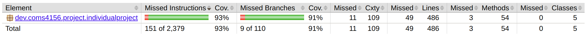

# COMS-4156-MiniProject

Ken Deng, kd3005

This is the GitHub repository for the Individual MiniProject of COMS 4156 -- 
Advanced Software Engineering.

## Building and Running a Local Instance

This project uses the environment requirements below:

1.  Maven 3.9.5: https://maven.apache.org/download.cgi Download and follow the 
installation instructions.
    
2. JDK 17.0.12: This project used JDK 17 for development so that is what we 
recommend you use: https://www.oracle.com/java/technologies/javase/jdk17-archive-downloads.html
    
3. IntelliJ IDE: We recommend using IntelliJ but you are free to use any
other IDE that you are comfortable with: https://www.jetbrains.com/idea/download/?section=linux

This MiniProject is developed using ubuntu (linux)

After cloning this repository, you can change the working directory to <code>
/IndividualProject/</code>. Then, you can use <code>mvn clean install</code> to
build the project, where this command installs the dependency and packages and
compiles your code and packages it into a <code>.jar</code> file.

Then, you can use <code>mvn checkstyle:check</code> to generate a style check, and
you can use <code>mvn clean test</code> to generate a JaCoCo test for the test
branch coverage. The test are located in 
<code>/IndividualProject/src/test/java/dev.coms4156.project.individualproject</code>
and new test cases can be added there.

To run the application, you can simply use <code>mvn spring-boot:run</code>, and
you can go to [http:127.0.0.1:8080/]() with your endpoint and query parameters or use
Postman to test the functionality.

## Running a Cloud based Instance

This project is also deployed onto Google Cloud App Engine, where you can access
to it at https://my-4156-project.uk.r.appspot.com/ with your endpoint and query
parameters. You can also use Postman to interact with this project as well.

## Style Checking Report Using mvn stylecheck

## Branch Coverage Reporting Using JaCoCo

## Video Demonstrating Successful Deployment and Functionality

You can access the video here: https://youtu.be/J7ctywfioRE

## Endpoints

### GET Endpoints

<code>"/"</code>, <code>"/index"</code>, <code>"/home"</code>: Redirects to
the homepage.

<code>/retrieveDept</code>: Returns the details of the specified department.

<code>/retrieveCourse</code>: Returns the details of the specified course.

<code>/retrieveCourses</code>: Returns the details of the requested courses
with specified
course code in any department.

<code>/isCourseFull</code>: Returns a boolean indicating whether the course
has at minimum reached its enrollmentCapacity.

<code>/getMajorCountFromDept</code>: Returns the number of majors in the
specified department.

<code>/idDeptChair</code>: Returns the department chair for the specified
department.

<code>/findCourseLocation</code>: Displays the location for the specified
course.

<code>/findCourseInstructor</code>: Returns the instructor for the specified
course.

<code>/findCourseTime</code>: Returns the time the course meets at for the
specified course.

### PATCH Endpoints

<code>/addMajorToDept</code>: Attempts to add a major to the specified
department.

<code>/removeMajorFromDept</code>: Attempts to remove a major from the
specified department.

<code>/enrollStudentInCourse</code>: Attempts to enroll a student from
the specified course.

<code>/dropStudentFromCourse</code>: Attempts to drop a student from
the specified course.

<code>/setEnrollmentCount</code>: Attempts to change enrolled student
count of a course.

<code>/changeCourseTime</code>: Attempts to change the time of a course.

<code>/changeCourseTeacher</code>: Attempts to change the instructor of
a course.

<code>/changeCourseLocation</code>: Attempts to change the location of
a course.

## Continuous Integration

This repository using GitHub Actions to perform continuous integration,
to view the latest results go to the following link:
https://github.com/KenD2002/4156-Miniproject-2024-Students-Java/actions

The CI configuration is specified in <code>.github/workflows/maven.yml</code>.

## Tools Used

* Google Cloud App Engine
* Maven Package Manager
* GitHub Actions CI
* mvn Checkstyle
* JaCoCo
* Postman
